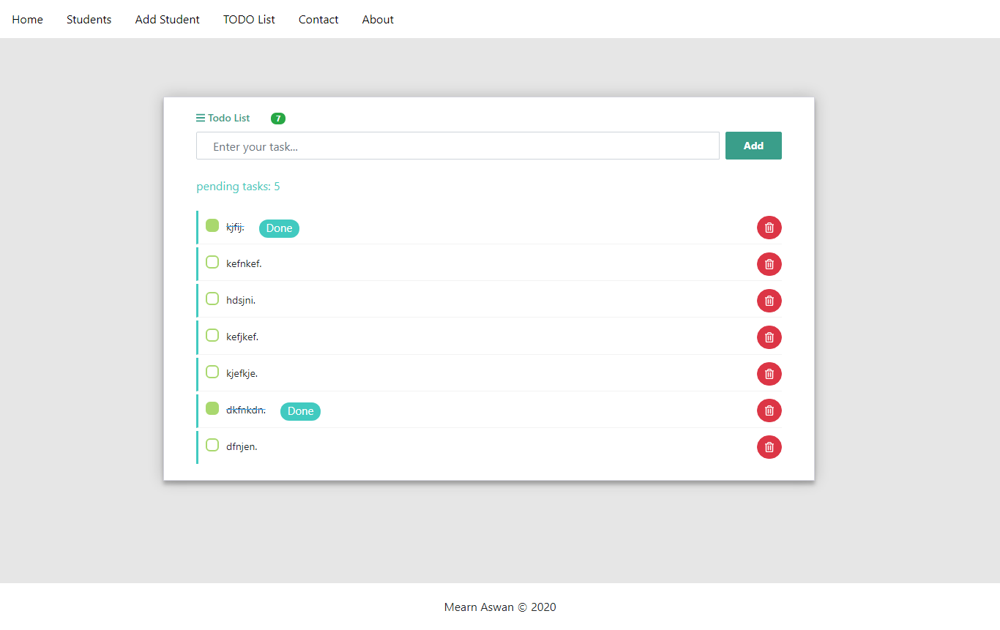
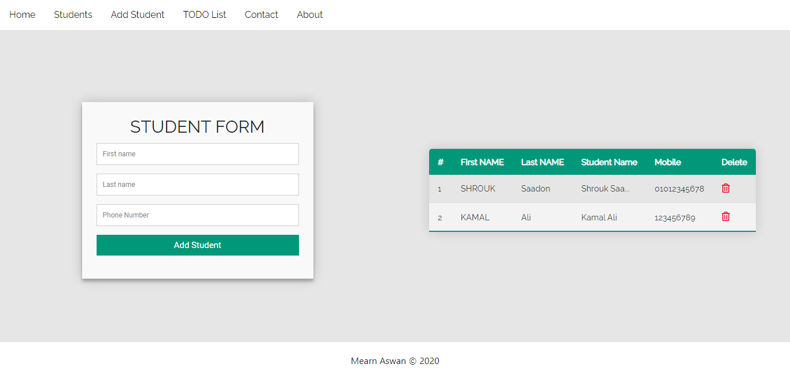

# angular-iti-tasks

Todo list & get users from api & delete user

## Development server

Run `ng serve` for a dev server. Navigate to `http://localhost:4200/`. The app will automatically reload if you change any of the source files.

